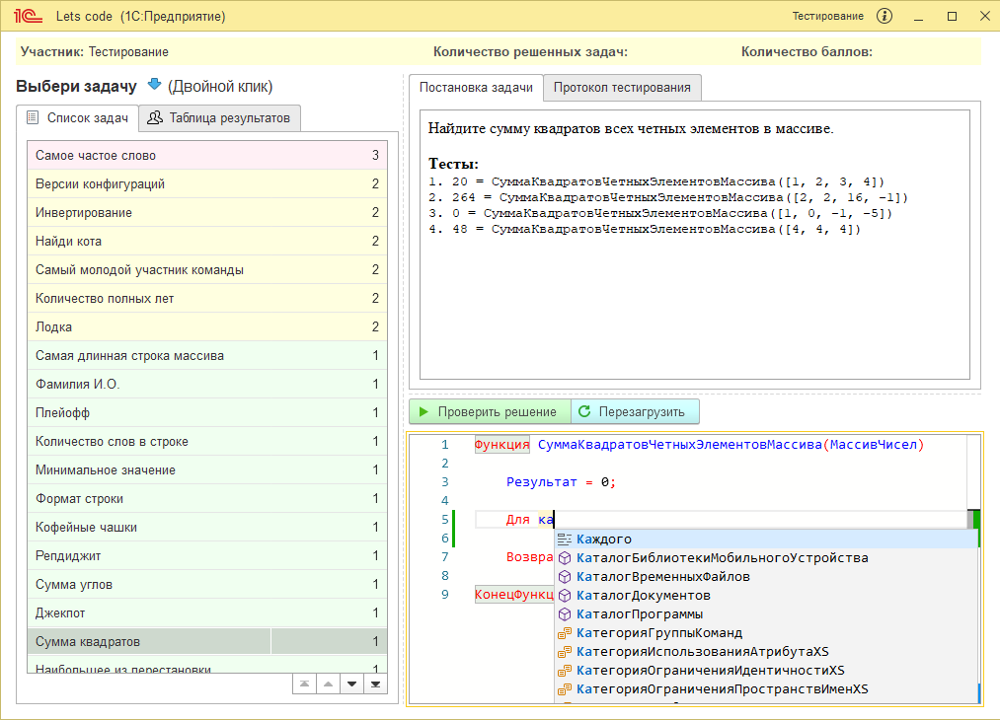

# Let's code - платформа для решения и проверки задач на встроенном языке 1С: Предприятие

[](https://t.me/simplelogic) 
[](https://github.com/plastinin/let-s-code/releases/latest)
[](https://github.com/plastinin/let-s-code/releases/download/latest/1cv8.cf)
[](https://github.com/plastinin/let-s-code/issues)
[](https://github.com/plastinin/let-s-code/blob/master/LICENSE)



## Области применения

- Площадка для тестирования соискателей - если в вашем процессе найма персонала предусмотрена процедура тестирования

- Тренажер для разработчиков - каждый может потренироваться в решении алгоритмических задач на встроенном языке 1С: Предприятие

- Челленджи - для реализации соревнований внутри команды разработки или комьюнити (по аналогии с [1С: Битва](https://youtu.be/crZg4xvQJdQ))

## Логика работы

- **Администратор** настраивает набор задач, количество баллов за решение и набор проверящих (unit) тестов

- **Участник тестирования** выбирает задачу(и) из списка, знакомится с ее постановкой, реализует решение на встроенное языке 1С: Предприятие, запускает проверку (unit) тестов. Если тест пройден успешно, участник тестирования может опубликовать решение. При публикации решения в регистре фиксируется количество баллов и предоставленный код

- **Администратор** имеет право увеличить/уменьшить количество баллов за конкретные решения/предоставленный код (например при _CodeReview_) с помощью инструмента _отчет Результаты тестирования_

### Состав релиза

Элемент | Назначение |
---------|----------|
 `1cv8.cf` | Конфигурация релиза|
 `demo-base.dt` | Демонстрационная база **с набором задач** |
 `Source code` | Исходники в формате 1С: EDT |

## Требования к программному обеспечению

- [OneScript](https://github.com/EvilBeaver/OneScript/releases/latest/) для работы движка проверки

- PowerShell

- Платформа 1С: Предприятие 8.3.16 и старше (для корректной работы буфера обмена)

## Публикации

- [1C: Битва 2.0](https://www.youtube.com/watch?v=crZg4xvQJdQ)
- [Решение задач с 1С: Битва 2.0](https://www.youtube.com/watch?v=1Y8XsGCJF_8)
- [Cтатья на Инфостарт](https://infostart.ru/public/1650118/)

## Благодарности

- [OneScript](https://github.com/EvilBeaver/OneScript)
- [Универсальные инструменты](https://github.com/cpr1c/tools_ui_1c)
- [Hexlet codebattle](https://github.com/hexlet-codebattle/battle_asserts/tree/master/src/battle_asserts/issues)
- [Юрий Пермитин](https://ypermitin.github.io) и его статья на Infostart [Вы запускаете приложения, но делаете это без уважения](https://infostart.ru/1c/articles/1266995/)

## Развитие

**Разработка**: 1С: EDT

**Руководство контрибьтора**: _в разработке_

**Бэклог задач**: [Issues](https://github.com/plastinin/let-s-code/issues)

## Поддержать автора

Лучший способ поддержать автора - рассказать в чате канала [Простая логика](https://t.me/simplelogic_chat) о том, как вы применили инструмент, и подписаться на наш YouTube-канал [Команда ИТК](https://www.youtube.com/channel/UCXCFK4G65cNI4soCev0mOWA)

## Информация о конфигурации

### Ролевая модель

Роль | Права | Режим основного окна
---------|----------|---------
 `Полные права` | Добавление задач и тестов, формирование отчета о резульататах тестирования | Обычный
 `Участник тестирования` | Тестирование | Рабочее место

### Структура задачи

Элемент | Назначение |
---------|----------|
 `Наименование` | Представление задачи в списке|
 `Актуальность` | Признак актуальность задачи. Неактульные задачи не отображаются в списке |
 `Постановка задачи` | Постановка задачи в формате HTML |
 `Шаблон кода` | Шаблон кода, который заполнится в окне редактора кода у участника тестирования при выборе задачи |
 `Набор тестов` | Таблица тестов См. [структура теста](#структура-теста) |

### Структура теста

Элемент | Назначение |
---------|----------|
 `Предустановка` | Инициализация входящих параметров функции|
 `Тест` | Исходный код теста. Тест будет **выполнен** если значение этого кода будет `Истина`|
 `Представление` | Визуальное отображение теста в протоколе тестирования|

### Алгоритм работы проверки задачи

1. Входная точка в алгоритм - `Справочники.ИТК_Задачи.ПолучитьРезультатыТестирования()`
2. Функция осуществляет подготовку протокола тестирования по [набору тестов](#структура-теста) для задачи
3. Тест считается успешным если, все тесты из набора выполнены `Истина`
4. Если хоть один тест завершился не успешно, процедура проверки завершается

#### Алгоритм проверки теста

1. Подготовка скрипта **OneScript** по шаблону

```bsl
%КОД_УЧАСТНИКА_ТЕСТИРОВАНИЯ%
Попытка
	%ПРЕДУСТАНОВКИ_ПАРАМЕТРОВ_ТЕСТА%
	%КОД_ТЕСТА%
Исключение
	Результат = ОписаниеОшибки();
КонецПопытки;
Сообщить(Результат);
```
2. Выполнение скрипта OneScript с помощью PowerShell
3. Анализ результата выполнения
