# Руководство контрибьютера проекта Let's code🚀

## Инструменты разработки

1. [EDT Ruby 2021.2.8+](https://releases.1c.ru/project/DevelopmentTools10)
2. [Git](https://git-scm.com/downloads)
3. [OScript](https://oscript.io/downloads)
4. [Платформа 1C:Предприятие 8.3.20+](https://releases.1c.ru/project/Platform83)

## Импорт конфигурации в 1С: EDT

### Создайте `fork` проекта из ветки `develop` [основного репозитория](https://github.com/plastinin/let-s-code)

### Создание проекта в 1C: EDT

1. Добавление проекта в 1С:EDT

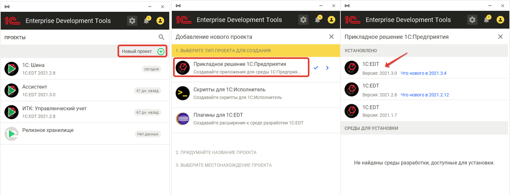

2. Настройки проекта

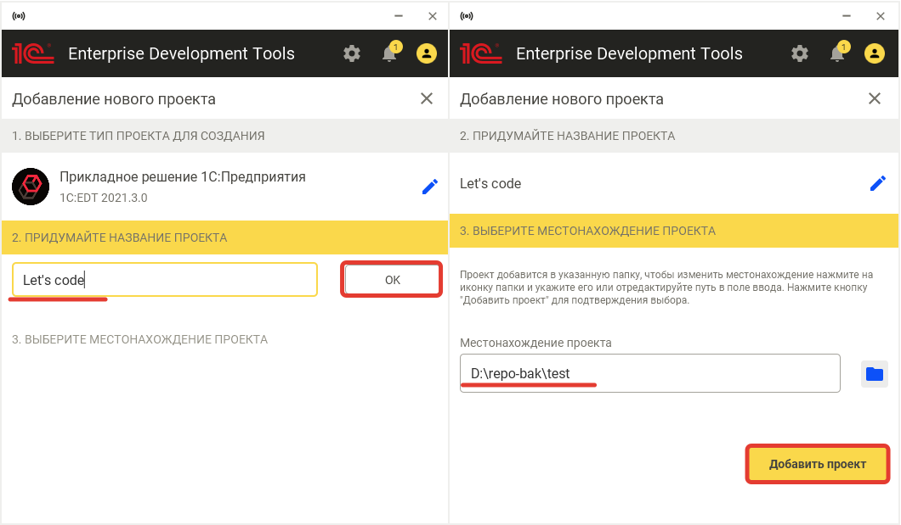

3. Импорт проекта с GITHub репозитория

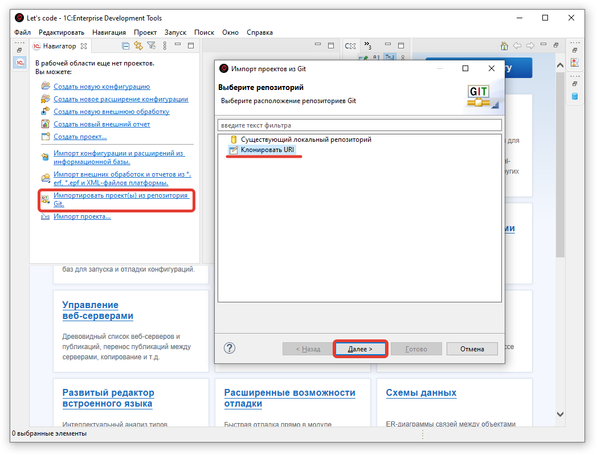

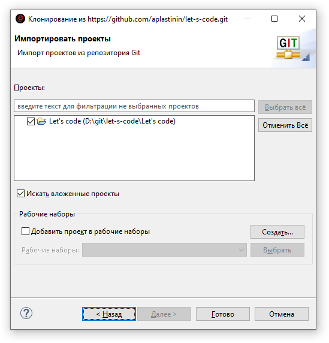

3. Если все было правильно сделано - конфигурация инициализируется в навигаторе

### Создание и обновление информационной базы

1. Настройка приложения отладки (Информационной базы)

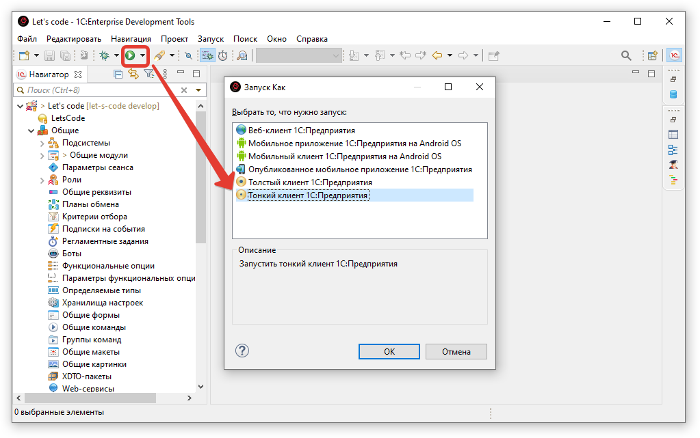

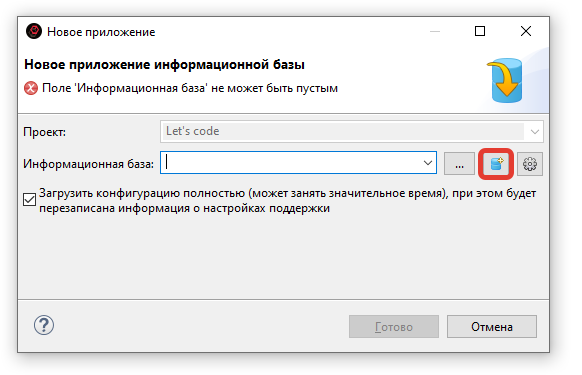

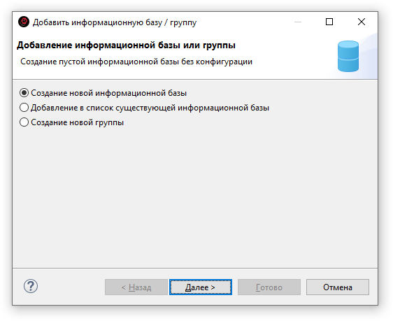

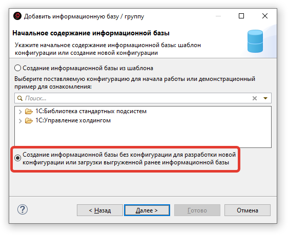

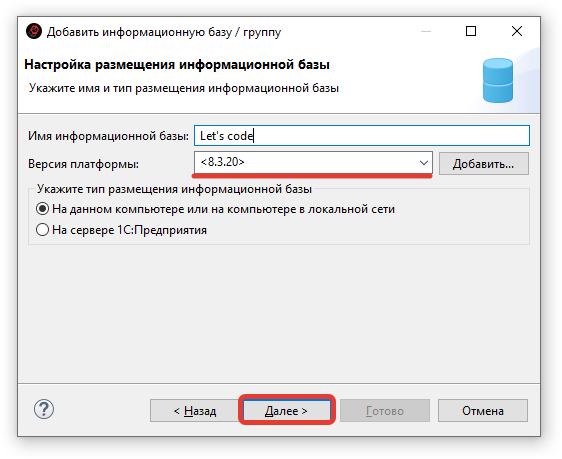

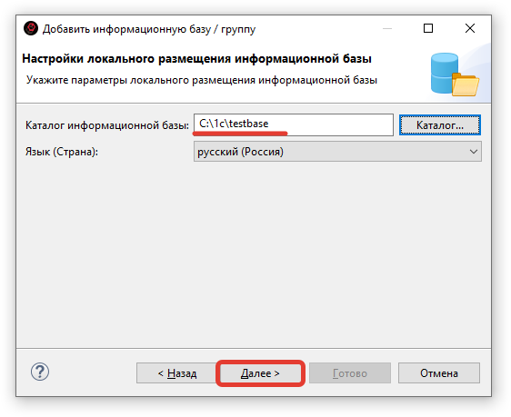

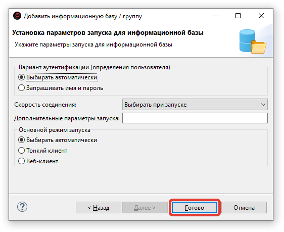

2. Если все правильно сделано - конфигурация информационной базы обновится, отобразится окно реорганизации и запуститься конфигурация в режиме предприятия

## Процесс разработки

1. Поищите задачу среди [issues](https://github.com/plastinin/let-s-code/issues) проекта

2. Если задачи нет, создайте свою.

3. В своей копии репозитория создайте новую branch, унаследованную от develop. 

> Именовать ветку рекомендуется по наименованию issues (feature)

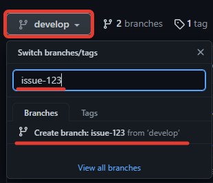

4. В 1С: EDT выполнить переключение на новую ветку

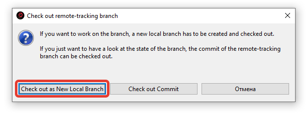

Если все выполнено правильно:

5. **Выполняете свои доработки конфигурации**

6. Поместите изменения в GIT-репозиторий

> В сообщения коммита рекомендуется указывать номер issues

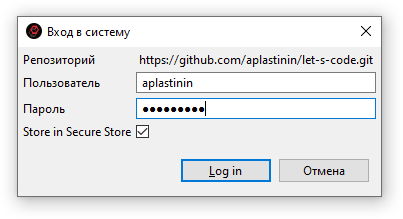

Если все правильно, то в GIT:

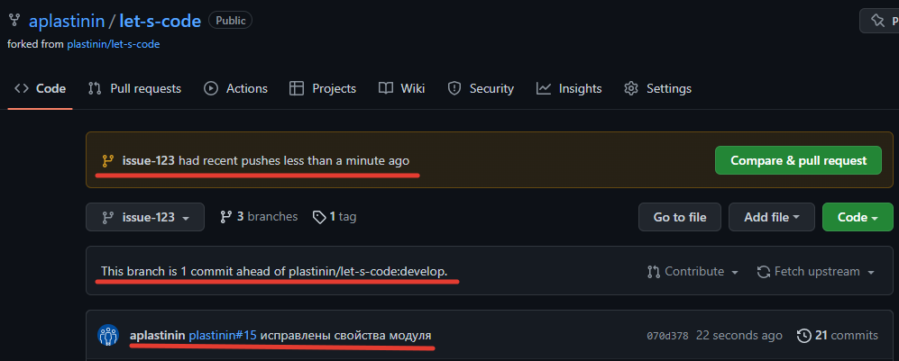

7. Сделайте перенос в [основной репозиторий](https://github.com/plastinin/let-s-code) с помощью `pull-request`

8. Ожидайте пока владельцы репозитория примут ваш `pull-request`

9. После акцепта `pull-request` вы получите уведомление с возможностью удаления созданной под `issues` ветки

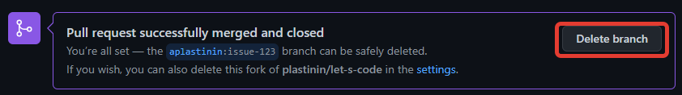

10. Синхронизируйте свою ветку 'develop'

## Рекомендации по разработке

1. Внимательно изучайте лицензии заимствуемых ресурсов: картинки, код, библиотеки и т.д.

2. Установите [Коннектор BSLLS для 1С:EDT](https://github.com/otymko/bslls-connector-for-edt) - это позволит осуществить предиктивный контроль соблюдения стандартов разработки. Постконтроль осуществляется в [SonarQube](https://sonar.openbsl.ru/dashboard?id=let-s-code)
